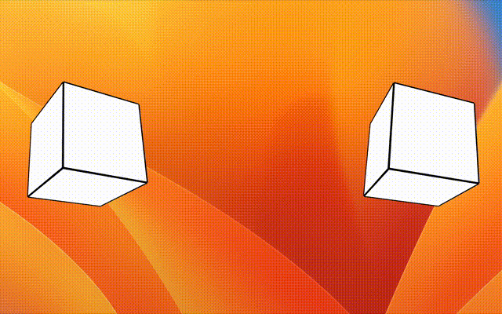

# nreal3d


nreal3D.js is a library to realize stereoscopic viewing using nreal air. Users can easily view any 3D model or space using p5.js canvas.

## Compatible
  * Only macOS, because of using Nebula.
## Getting Started

1. Please install Nebula for Mac. https://www.nreal.ai/nebula
2. Follow the below steps
```
> git clone https://github.com/TetsuakiBaba/nreal3d.git
> cd nreal3d
> npm install
> npm start
  ```
have a fun.

## Dependencies (npm)
 * electron

 ## Copyright
  * author: Tetsuaki BABA

## License
 * MIT license